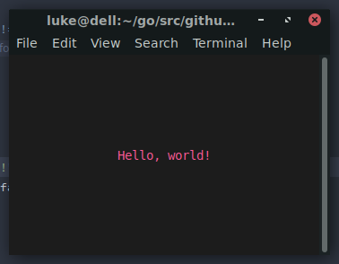

# dos
Make portable MS-DOS style graphics with this library which draws inspiration
from the React and Flutter projects. Compose interfaces with Widgets.
A [Widget](widget.go) is the interface that all UI components implement, which
provides five essential functions:

 1. HandleMouse (process click events)
 2. HandleKey (process key events)
 3. SetFocused (alert the widget that it has become focused)
 4. DisplaySize (produce the predicted size of the widget)
 5. Draw (render the component using [tcell](https://pkg.go.dev/github.com/gdamore/tcell/v2))

Each widget is controlled by its parent, but it does not know its parent. This
means widgets are reusable and rather predictable. Let's look at an example where
we have a Center widget with a label child to see this in effect.

```go
widget := &dos.Center{
    Child: &dos.Label{
        Text:  "Hello, world!",
        Style: tcell.StyleDefault.Foreground(tcell.ColorRed),
    },
}
```

We compose a simple user interface where the label text "Hello, world!" will be
centered in the window by the Center widget. Each widget has its own properties,
but many have sane defaults. For example, I have omitted the Align property for
the Label, so the default value is AlignLeft. Finally, we always take the reference
of components, so they may become shallow and passed as the Widget type.

This is what the Center struct looks like:

```go
type Center struct {
	Child Widget
}
```

Widget is that interface mentioned earlier. This is what the example looks like
running on my terminal:



You can [read the source code for the Center widget](center.go). It's a rather
simple container, as it just passes on events and does very little to draw. A more
complex container might be the [Align](align.go) or [Column](column.go). The
[Label](label.go) widget is also fairly complex, as it ensures compatibility
with tricky double-wide characters while allowing for cool features like alignment
and box-bounding.

But these are all real widgets that you could make with or without the dos library.
There's not a lot of boilerplate, and there's not much going on under the hood.
I just think I've done a good job providing your next project a good architectural
base, and a good selection of MS-DOS inspired widgets.
